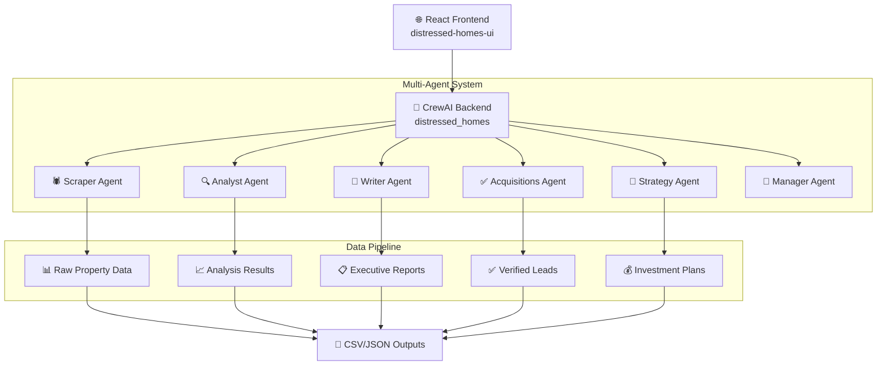
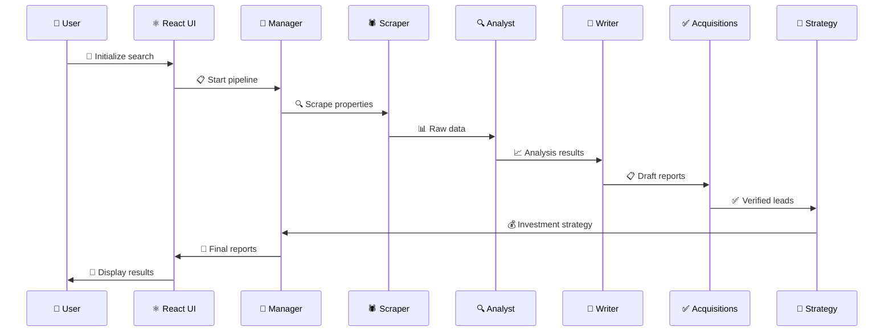

# 🏠 Distressed Homes AI Pipeline

<div align="center">

[](https://www.python.org/)
[](https://reactjs.org/)
[](https://crewai.com/)
[](https://vitejs.dev/)
[](LICENSE)

**🤖 AI-Powered Real Estate Investment Pipeline**  
*Intelligent multi-agent system for identifying, analyzing, and qualifying distressed properties*

[🚀 Quick Start](#-quick-start) • [📁 Project Structure](#-project-structure) • [🔧 Setup Guide](#-setup-guide) • [🤝 Contributing](#-contributing)

---

### 📷 Project Preview

*📷 Add screenshots here showing the UI dashboard and sample reports*

</div>

## 📋 Table of Contents

<details>
<summary>Click to expand</summary>

- [🏠 Distressed Homes AI Pipeline](#-distressed-homes-ai-pipeline)
- [📋 Table of Contents](#-table-of-contents)
- [✨ Features](#-features)
- [🏗️ Architecture](#️-architecture)
- [📁 Project Structure](#-project-structure)
- [🚀 Quick Start](#-quick-start)
  - [Prerequisites](#prerequisites)
  - [Backend Setup (CrewAI)](#backend-setup-crewai)
  - [Frontend Setup (React)](#frontend-setup-react)
- [🔧 Environment Configuration](#-environment-configuration)
- [📊 Usage & Commands](#-usage--commands)
  - [Backend Commands](#backend-commands)
  - [Frontend Commands](#frontend-commands)
- [🤖 AI Agents Overview](#-ai-agents-overview)
- [📈 Data Flow](#-data-flow)
- [🔐 Security & Compliance](#-security--compliance)
- [🧪 Testing](#-testing)
- [🚀 Deployment](#-deployment)
- [🤝 Contributing](#-contributing)
- [❓ FAQ & Troubleshooting](#-faq--troubleshooting)
- [📄 License](#-license)
- [👥 Contact & Credits](#-contact--credits)

</details>

---

## ✨ Features

🎯 **Core Capabilities**

- 🔍 **Intelligent Property Scraping** - Multi-source real estate data aggregation
- 🧠 **AI-Powered Analysis** - Machine learning distress signal detection
- 📊 **Executive Reporting** - Investor-ready property assessments
- 🏢 **Investment Strategy** - Automated acquisition recommendations
- 📱 **Modern Web Interface** - React-based dashboard for monitoring

🚀 **Advanced Features**

- ⚡ **Real-time Processing** - Live property data updates
- 🔒 **Compliance Ready** - Built-in legal and regulatory checks
- 📈 **Market Analytics** - West Coast hot market focus
- 🤝 **Investor Matching** - Automated lead distribution
- 📋 **Audit Trails** - Complete transaction documentation

---

## 🏗️ Architecture



---

## 📁 Project Structure

```
distressed-homes-ai/
├── 📄 README.md                          # This file
├── 📄 .gitignore                         # Git ignore patterns
├── 📄 Codebase structure.md              # Detailed code analysis
│
├── 🐍 distressed_homes/                  # CrewAI Backend
│   ├── 📁 src/distressed_homes/
│   │   ├── 🤖 crew.py                    # Main crew orchestration
│   │   ├── 🚀 main.py                    # Entry point & CLI
│   │   ├── 📁 config/
│   │   │   ├── 👥 agents.yaml            # Agent definitions
│   │   │   └── 📋 tasks.yaml             # Task workflows
│   │   └── 🛠️ tools/
│   │       └── ⚙️ custom_tool.py         # Custom CrewAI tools
│   ├── 📊 results/                       # Generated reports & data
│   ├── 🧠 knowledge/                     # User preferences & context
│   ├── 📦 pyproject.toml                 # Python dependencies
│   └── 🔒 uv.lock                        # Dependency lock file
│
└── ⚛️ distressed-homes-ui/                # React Frontend
    ├── 📁 src/
    │   ├── 🎯 App.jsx                     # Main application
    │   ├── 🚀 main.jsx                    # React entry point
    │   ├── 🎨 styles.css                  # Global styles
    │   └── 📁 components/
    │       ├── 📝 InputForm/              # Property search forms
    │       ├── 📊 OutputViewer/           # Results display
    │       ├── 🔄 ProgressStepper/        # Workflow tracking
    │       ├── 📋 AuditChecklist/         # Compliance verification
    │       ├── 📥 DealPackDownload/       # Report generation
    │       ├── 👥 InvestorList/           # Contact management
    │       ├── 🔔 Notification/           # Status updates
    │       └── 📜 ScriptTemplates/        # Communication scripts
    ├── 📦 package.json                    # Node.js dependencies
    └── ⚙️ vite.config.js                  # Vite configuration
```

---

## 🚀 Quick Start

### Prerequisites

Ensure you have the following installed:

- 🐍 **Python 3.10+** - [Download here](https://www.python.org/downloads/)
- 📦 **Node.js 18+** - [Download here](https://nodejs.org/)
- 🛠️ **UV Package Manager** - `pip install uv`
- 🔧 **Git** - [Download here](https://git-scm.com/)

### Backend Setup (CrewAI)

```bash
# 1. Navigate to backend directory
cd distressed_homes

# 2. Create and activate virtual environment
.\crew-env\Scripts\Activate.ps1  # Windows PowerShell
# OR
source crew-env/bin/activate     # Linux/macOS

# 3. Install dependencies
uv sync
# OR
crewai install

# 4. Configure environment (see Environment section below)
cp .env.example .env
# Edit .env with your API keys

# 5. Run the system
crewai run
# OR
python -m distressed_homes
```

### Frontend Setup (React)

```bash
# 1. Navigate to frontend directory
cd distressed-homes-ui

# 2. Install dependencies
npm install

# 3. Start development server
npm run dev

# 4. Open browser to http://localhost:5173
```

---

## 🔧 Environment Configuration

Create a `.env` file in the `distressed_homes` directory:

```bash
# ==============================================
# API Keys (Required)
# ==============================================
OPENAI_API_KEY=sk-your-openai-api-key-here
SERPER_API_KEY=your-serper-dev-api-key-here

# ==============================================
# Model Configuration
# ==============================================
GPT41=openai/gpt-4o                    # Primary LLM model
OPENAI_MODEL_NAME=gpt-4o               # Fallback model

# ==============================================
# Data Sources (Optional)
# ==============================================
PROPSTREAM_API_KEY=your-propstream-key
FORECLOSURE_API_KEY=your-foreclosure-key

# ==============================================
# Output Configuration
# ==============================================
RESULTS_PATH=./results                 # Output directory
MAX_PROPERTIES=25                      # Properties per run
```

### 🔑 Required API Keys

| Service | Purpose | Get Key |
|---------|---------|---------|
| 🤖 **OpenAI** | AI agent reasoning | [OpenAI Platform](https://platform.openai.com/) |
| 🔍 **Serper** | Web search & data | [Serper.dev](https://serper.dev/) |
| 🏠 **PropStream** | Property data (optional) | [PropStream](https://www.propstream.com/) |

---

## 📊 Usage & Commands

### Backend Commands

```bash
# Main execution
crewai run                             # Run full pipeline
python -m distressed_homes.main run   # Alternative execution

# Training & replay
crewai train                           # Train agents on data
crewai replay <task_id>                # Replay specific execution

# Testing
python -m pytest                      # Run test suite
crewai test                           # CrewAI-specific tests
```

### Frontend Commands

```bash
# Development
npm run dev                           # Start dev server (port 5173)
npm run build                        # Build for production
npm run preview                      # Preview production build

# Code quality
npm run lint                          # ESLint code analysis
npm run lint:fix                     # Auto-fix linting issues
```

---

## 🤖 AI Agents Overview

| Agent | 🎯 Role | 📋 Responsibilities |
|-------|---------|-------------------|
| 👑 **Manager** | Strategic Orchestrator | Workflow oversight, QA, compliance validation |
| 🕷️ **Scraper** | Data Collector | Multi-source property data aggregation |
| 🔍 **Analyst** | Pattern Detective | Distress signal analysis & scoring |
| 📝 **Writer** | Report Generator | Executive-level documentation |
| ✅ **Acquisitions** | Verification Specialist | Legal compliance & due diligence |
| 💼 **Strategy** | Investment Planner | Investor matching & action plans |

---

## 📈 Data Flow



---

## 🔐 Security & Compliance

### 🛡️ Data Protection

- ✅ Environment variable encryption
- ✅ No hardcoded credentials
- ✅ Secure API key management
- ✅ Local data processing priority

### ⚖️ Legal Compliance

- ✅ CCPA-compliant data handling
- ✅ Fair housing law adherence
- ✅ Public records only sourcing
- ✅ Audit trail maintenance

### 🔒 Best Practices

- 🔐 Regular dependency updates
- 🔍 Code quality enforcement
- 📝 Comprehensive logging
- 🧪 Automated testing

---

## 🧪 Testing

```bash
# Backend testing
cd distressed_homes
python -m pytest tests/              # Run all tests
python -m pytest -v                  # Verbose output
python -m pytest --cov              # Coverage report

# Frontend testing (when implemented)
cd distressed-homes-ui
npm test                             # Jest test runner
npm run test:coverage               # Coverage analysis
```

---

## 🚀 Deployment

### 🌐 Frontend Deployment (Vercel/Netlify)

```bash
# Build for production
cd distressed-homes-ui
npm run build

# Deploy to Vercel
npx vercel --prod

# Deploy to Netlify
netlify deploy --prod --dir=dist
```

### 🐍 Backend Deployment (Railway/Render)

```bash
# Prepare for deployment
cd distressed_homes
uv export --format requirements-txt > requirements.txt

# Configure deployment environment
# Set environment variables in hosting platform
# Ensure Python 3.10+ runtime selected
```

---

## 🤝 Contributing

We welcome contributions! Please follow these guidelines:

### 🔀 Development Workflow

1. **🍴 Fork the repository**
2. **🌟 Create a feature branch**: `git checkout -b feature/amazing-feature`
3. **💻 Make your changes** with proper testing
4. **📝 Commit with conventional commits**: `git commit -m "feat: add amazing feature"`
5. **🚀 Push to branch**: `git push origin feature/amazing-feature`
6. **📬 Create a Pull Request**

### 📋 Code Standards

- 🐍 **Python**: Follow PEP 8, use type hints
- ⚛️ **React**: Use functional components, proper JSX
- 📝 **Documentation**: Update README for new features
- 🧪 **Testing**: Include tests for new functionality

### 🐛 Bug Reports

Use the [GitHub Issues](https://github.com/your-username/distressed-homes-ai/issues) template:

```markdown
**🐛 Bug Description**
A clear description of the bug.

**📋 Steps to Reproduce**
1. Step one
2. Step two
3. See error

**💻 Environment**
- OS: [e.g., Windows 11]
- Python: [e.g., 3.11]
- Node.js: [e.g., 18.16]
```

---

## ❓ FAQ & Troubleshooting

<details>
<summary><strong>🚨 Common Issues</strong></summary>

### **❌ "Module not found" errors**

```bash
# Ensure proper environment activation
.\crew-env\Scripts\Activate.ps1
# Reinstall dependencies
uv sync --reinstall
```

### **🔑 API key errors**

```bash
# Verify .env file exists and has correct keys
cat .env  # Linux/macOS
Get-Content .env  # Windows PowerShell
```

### **🌐 Frontend build failures**

```bash
# Clear cache and reinstall
rm -rf node_modules package-lock.json  # Linux/macOS
npm install
```

### **🐍 Python version conflicts**

```bash
# Check Python version
python --version
# Should be 3.10 or higher
```

</details>

<details>
<summary><strong>🎯 Performance Optimization</strong></summary>

### **Backend Performance**

- ⚡ Use caching for repeated API calls
- 🔄 Implement async processing where possible
- 📊 Monitor agent execution times

### **Frontend Performance**

- 🗜️ Enable build compression
- 📱 Implement lazy loading
- 🎨 Optimize asset delivery

</details>

<details>
<summary><strong>🔧 Development Tips</strong></summary>

### **Debugging CrewAI**

```bash
# Enable verbose logging
export CREWAI_LOG_LEVEL=DEBUG
crewai run
```

### **React Development**

```bash
# Hot reload with specific port
npm run dev -- --port 3000
```

</details>

---

## 📄 License

This project is licensed under the **MIT License** - see the [LICENSE](LICENSE) file for details.

```
MIT License - Feel free to use, modify, and distribute! 🎉
```

---

## 👥 Contact & Credits

<div align="center">

### 🎯 Project Maintainer

**Christopher Jordon** - *AI Engineer & Project Lead*  
📧 [your.email@example.com](mailto:your.email@example.com)  
🔗 [LinkedIn](https://linkedin.com/in/yourprofile) • [GitHub](https://github.com/yourusername)

### 🌟 Built With

[](https://crewai.com/)
[](https://openai.com/)
[](https://reactjs.org/)
[](https://vitejs.dev/)

### 🙏 Special Thanks

- 🤖 **CrewAI Team** - For the amazing multi-agent framework
- 🏠 **Real Estate Community** - For domain expertise and feedback
- 👥 **Open Source Contributors** - For making this project possible

---

<div align="center">

**🏠 Made with ❤️ for Real Estate Investors**

*⭐ Star this repo if it helps your investment journey! ⭐*

</div>

</div>

---

<div align="center">
<sub>📝 Last updated: July 16, 2025 | 🔄 Version: 1.0.0</sub>
</div>
