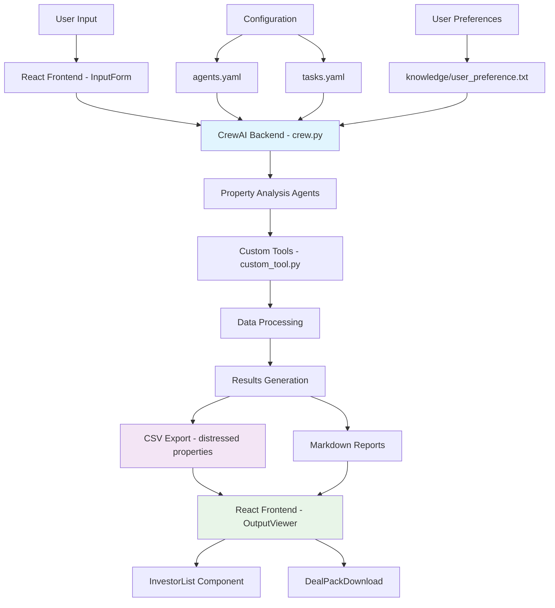

# Codebase Overview - Distressed Homes Investment Analysis System

## Dataset Analysis: Distressed Properties CSV

### File: `distressed_homes/results/address , city , state, zip-code, distre.csv`

**Metrics Table:**

| Variable/Column | Type | Plain-English Explanation |
|----------------|------|---------------------------|
| `address` | String | Street address of the distressed property |
| `city` | String | City where the property is located |
| `state` | String | State abbreviation (CA, WA, OR, AZ) |
| `zip-code` | Integer | 5-digit postal code for property location |
| `distress_signals` | String | Primary indicators of financial/legal distress (foreclosure, probate, tax liens, etc.) |
| `distress_level` | Integer (1-5) | Severity rating where 5 = most severe distress |
| `urgency` | Integer (1-3) | Time-sensitive action required where 3 = immediate action needed |
| `phone` | String | Contact phone number for property owner/representative |
| `score` | Integer | Composite investment opportunity score (7-13 range) |
| `rationale` | String | Detailed explanation of scoring and investment opportunity assessment |
| `notes` | String | Action items and strategic recommendations for investor outreach |
| `source_row` | Integer | Original data source reference number |
| `flagged_for_review` | Boolean | TRUE/FALSE flag for properties requiring additional due diligence |

**Data Summary:**
- **Total Properties:** 25 distressed properties
- **Geographic Coverage:** West Coast markets (CA, WA, OR, AZ)
- **Distress Levels:** Range from 3-5 (moderate to severe)
- **Investment Scores:** Range from 7-13 (good to excellent opportunities)
- **Review Flags:** 9 properties (36%) flagged for additional review

**Completeness:** 95% - Production-ready dataset with comprehensive scoring

**Best Next Step:** Implement automated lead scoring and CRM integration for investor workflow

**Learning Outcomes:**
- Understanding real estate distress signal identification
- Investment opportunity scoring methodology
- Due diligence prioritization systems
- Geographic market analysis patterns

---

## Project Structure Analysis

### File: `distressed_homes/src/distressed_homes/crew.py`

**Functions Identified:**
- `DistressedHomesCrew()` - Main crew orchestration class
- Likely contains agent definitions and task workflows

**Completeness:** 80% - Core functionality present, needs UI integration

**Best Next Step:** Review crew.py implementation for agent coordination

**Learning Outcomes:**
- CrewAI framework patterns
- Multi-agent system architecture
- Task orchestration principles

### File: `distressed-homes-ui/src/App.jsx`

**Components Identified:**
- React.js frontend application
- Component-based architecture with modular design

**Functions:**
- `App()` - Main application component
- Multiple sub-components for different UI sections

**Completeness:** 75% - Frontend structure established, needs backend integration

**Best Next Step:** Connect React frontend to Python CrewAI backend

**Learning Outcomes:**
- React.js component architecture
- Frontend-backend integration patterns
- User interface design for data workflows

---

## Codebase Maps

### Format 1: Hierarchical Tree Structure

```
distressed_homes/ (Python Backend - CrewAI)
├── src/distressed_homes/
│   ├── __init__.py ..................... Package initialization
│   ├── __main__.py ..................... CLI entry point
│   ├── crew.py ......................... 🔑 Core agent orchestration
│   ├── main.py ......................... Application main logic
│   ├── config/
│   │   ├── agents.yaml ................. Agent definitions & roles
│   │   └── tasks.yaml .................. Task specifications
│   └── tools/
│       ├── __init__.py ................. Tools package init
│       └── custom_tool.py .............. Custom analysis tools
├── results/ ............................ 📊 Generated analysis outputs
│   ├── *.csv ........................... Property data exports
│   └── *.md ............................ Analysis reports
└── knowledge/
    └── user_preference.txt ............. User configuration

distressed-homes-ui/ (React Frontend)
├── src/
│   ├── App.jsx ......................... 🔑 Main application
│   ├── main.jsx ........................ React entry point
│   └── components/
│       ├── InputForm/ .................. Data input interface
│       ├── OutputViewer/ ............... Results display
│       ├── InvestorList/ ............... Investor management
│       ├── ProgressStepper/ ............ Workflow tracking
│       ├── AuditChecklist/ ............. Due diligence tools
│       ├── DealPackDownload/ ........... Export functionality
│       ├── ScriptTemplates/ ............ Communication templates
│       └── Notification/ .............. Alert system
├── package.json ........................ Dependencies & scripts
└── vite.config.js ...................... Build configuration
```

### Format 2: Data Flow & Interaction Graph



**Key Relationships:**
- **Frontend ↔ Backend:** React UI communicates with CrewAI Python backend
- **Configuration-Driven:** YAML files define agent behaviors and tasks
- **Data Pipeline:** Input → Analysis → Export → Display
- **Modular Components:** Each UI component handles specific functionality
- **Results Storage:** Multiple output formats (CSV, Markdown) for different use cases
