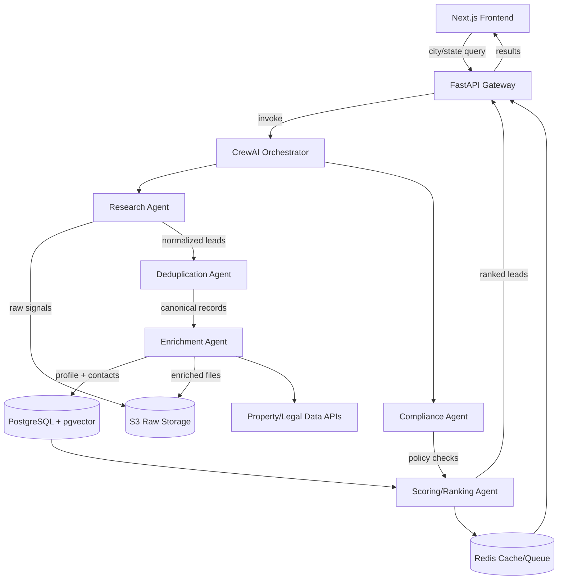

# Distressed Home Prospect Finder — Architecture Blueprint

## System Overview
A multi-agent CrewAI backend coordinates data acquisition, enrichment, and scoring for distressed properties. FastAPI exposes the workflow as an API consumed by a Next.js front end. Data and logs are persisted to PostgreSQL and S3, with Redis for caching/queues.

## Agent Design
- **Research Agent**: Pulls foreclosure/tax lien/code violation feeds per city/state, normalizes addresses/APN, captures source URLs and timestamps.
- **Deduplication Agent**: Merges records using address/APN similarity (Levenshtein and geocode proximity) and semantic similarity (optional pgvector embeddings on property text snippets).
- **Enrichment Agent**: Calls property profile APIs (ATTOM/Estated/DataTree), geocoding, and contact enrichment providers; flags owner-occupancy and lien balances.
- **Scoring/Ranking Agent**: Computes distress score from rule-based features + optional light model; outputs recommended outreach action and rationale.
- **Compliance Agent**: Checks DNC/consent status, suppresses restricted records, ensures data provenance fields present.

## Data Model (draft)
- `properties`: id, address fields, geocode, parcel/APN, city, state, zip, county, property_type, year_built, square_feet.
- `distress_signals`: property_id, source, signal_type (foreclosure, lien, code_violation, vacancy, utility), severity, amount, dates, raw_url, retrieved_at.
- `contacts`: property_id, owner_name, phones (jsonb), emails (jsonb), consent_status, dnc_flags, source, last_verified_at.
- `scores`: property_id, distress_score, rationale, recommended_action, version, computed_at.
- `jobs`: request_id, city, state, status, started_at, completed_at, result_count, error_log.
- `suppression`: contact identifier, reason, expires_at.

## API Surface (FastAPI)
- `POST /api/prospects/search`: body `{city, state, filters?, async?}`; triggers crew run. If async, returns `request_id` and status endpoint; sync waits with timeout.
- `GET /api/prospects/{request_id}`: returns status and ranked prospects payload.
- `GET /api/prospects/{request_id}/export.csv`: CSV export of current results.
- `POST /api/suppress`: add suppression/opt-out entry for contact/property; audited.
- Auth via JWT/OAuth2; RBAC roles: viewer (redacted contacts), analyst (full contacts), admin (manage suppression/settings).

## Frontend Flow (Next.js)
1. User inputs city + state, optional filters (min distress score, signal types).
2. Call `POST /api/prospects/search`; show job status/progress.
3. Display results table with sorting, filtering, disclosure banners, and action buttons (export CSV, copy to CRM webhook).
4. Provide opt-out submission form tied to suppression endpoint.

## Security and Compliance
- Secrets via environment variables/Secrets Manager; no secrets in repo.
- TLS everywhere; encrypt PII fields in DB (pgcrypto) and limit access via column-level privileges.
- Logging/observability: structured logs with request/agent/task IDs; CrewAI transcripts stored with retention policy.
- Rate limits per user/IP; WAF on API gateway; input validation via pydantic models.

## Deployment and Operations
- **Containerization**: Dockerfiles for API and Crew workers; multi-stage builds.
- **CI/CD**: GitHub Actions running lint/test, building images, pushing to registry, IaC plan/apply gates.
- **Runtime**: ECS Fargate (API) + separate worker service for long-running Crew jobs; Redis or SQS for job queue.
- **Monitoring**: CloudWatch/Datadog metrics (job latency, success rate, API p95), alerting on failures; tracing with OpenTelemetry.

## Iterative Improvement Loop
- Track outreach outcomes (contacted, appointment set, contract won) and feed back into scoring features.
- A/B test scoring weight sets or ML models; log version per score row.
- Use CrewAI logs to fine-tune prompts/tools monthly; adjust suppression and consent logic as regulations evolve.

## Sample MVP Run
- Input: `Las Vegas, NV`.
- Flow: Research Agent fetches Clark County pre-foreclosure list + code violations open data; Enrichment Agent appends AVM and contact; Scoring Agent highlights auctions <30 days and high lien balances; Compliance Agent removes DNC numbers; API returns top 10 with actions like `"Call owner within 3 days"` or `"Send hardship-assistance mailer"`.
